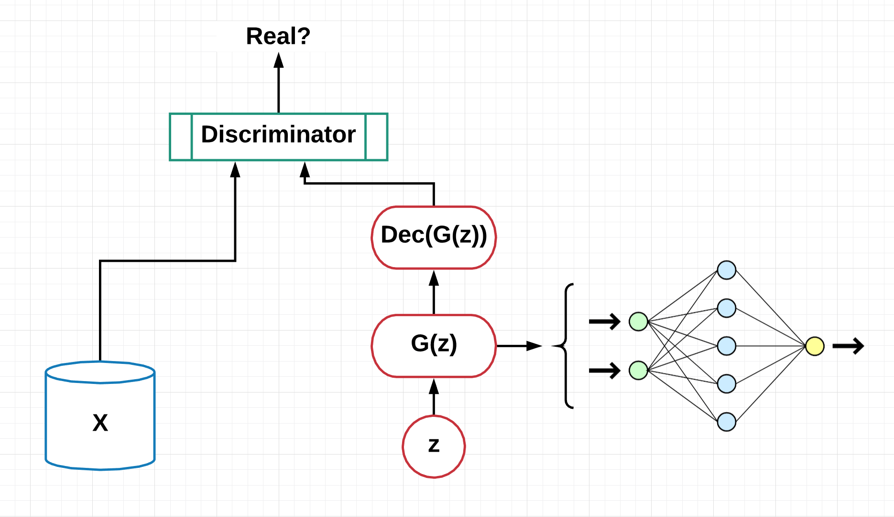
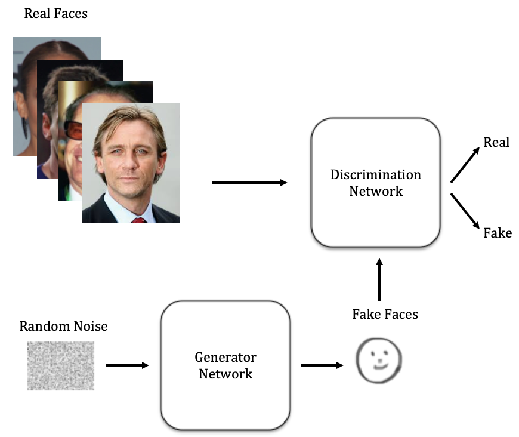

.. figure:: _img/teaser.gif
  :target: https://machinelearningmindset.com/blog/

.. figure:: _img/subscribe.gif
  :target: https://machinelearningmindset.com/subscription/

###################################################
GANs World Resources
###################################################

.. image:: https://img.shields.io/badge/contributions-welcome-brightgreen.svg?style=flat
    :target: https://github.com/machinelearningmindset/GANs-Roadmap/pulls
.. image:: https://badges.frapsoft.com/os/v2/open-source.png?v=103
    :target: https://github.com/ellerbrock/open-source-badge/
.. image:: https://img.shields.io/badge/Made%20with-Python-1f425f.svg
      :target: https://www.python.org/
.. image:: https://img.shields.io/pypi/l/ansicolortags.svg
      :target: https://github.com/astorfi/Awsome-GANs-World/blob/master/LICENSE
.. image:: https://img.shields.io/twitter/follow/machinemindset.svg?label=Follow&style=social
      :target: https://twitter.com/machinemindset

##################
Table of Contents
##################
.. contents::
  :local:
  :depth: 4

***************
Introduction
***************

The purpose of this project is to introduce a shortcut to developers and researcher
for finding useful resources about ``Generative Adversarial Networks``.

============
Motivation
============

There are different motivations for this open source project.

.. --------------------
.. Why Deep Learning?
.. --------------------

------------------------------------------------------------
What's the point of this open source project?
------------------------------------------------------------

The organization of the resources is such that the user can easily find the things he/she is looking for.
We divided the resources to a large number of categories that in the beginning one may
have a headache!!! However, if someone knows what is being located, it is very easy to find the most related resources.
Even if someone doesn't know what to look for, in the beginning, the list of resources have
been provided.

.. ================================================
.. How to make the most of this effort
.. ================================================

************
Papers
************

.. image:: _img/mainpage/article.jpeg

This chapter is associated with the papers published associated with generative adversarial Networks.

========================================
Types and Models
========================================

Image by: `Rouzbeh Asghari Shirvani <https://www.linkedin.com/in/rozbeh/_>`_

----------------------------------------------------
Core: Generative Adversarial Networks (VanillaGAN)
----------------------------------------------------

.. _ganpaper: http://papers.nips.cc/paper/5423-generative-adversarial-nets.pdf
.. _gancode: https://github.com/goodfeli/adversarial

.. _energyganpaper: https://arxiv.org/pdf/1609.03126v2.pdf
.. _energygancode: https://github.com/buriburisuri/ebgan

.. _convergepaper: https://arxiv.org/pdf/1801.04406.pdf
.. _convergecode: https://github.com/LMescheder/GAN_stability

+--------------------------------------------------------------------+-------------------------------+---------------------------+------------------------------------------------+
| Title                                                              |    Text                       |    Software               |    Citation                                    |
+====================================================================+===============================+===========================+================================================+
| Generative Adversarial Nets                                        | `Paper <ganpaper_>`_          | `Code <gancode_>`_        |  Rate :star2: :star2: :star2: :star2: :star2:  |
+--------------------------------------------------------------------+-------------------------------+---------------------------+------------------------------------------------+
| ENERGY-BASED GENERATIVE ADVERSARIAL NETWORK                        | `Paper <energyganpaper_>`_    | `Code <energygancode_>`_  |  Rate :star2: :star2: :star2: :star2:          |
+--------------------------------------------------------------------+-------------------------------+---------------------------+------------------------------------------------+
| Which Training Methods for GANs do Actually Converge               | `Paper <convergepaper_>`_     | `Code <convergecode_>`_   |  Rate :star2: :star2:                          |
+--------------------------------------------------------------------+-------------------------------+---------------------------+------------------------------------------------+

----------------------------------------------------------
Conditional Generative Adversarial Networks (CGAN)
----------------------------------------------------------

.. _conganpaper: https://arxiv.org/abs/1411.1784
.. _congancode: https://github.com/zhangqianhui/Conditional-GAN

.. _photorealpaper: https://arxiv.org/pdf/1609.04802.pdf
.. _photorealcode: https://github.com/tensorlayer/srgan

.. _im2impaper: https://arxiv.org/abs/1611.07004
.. _im2imcode: https://github.com/phillipi/pix2pix

.. _vismanpaper: https://arxiv.org/abs/1609.03552
.. _vismancode: https://github.com/junyanz/iGAN

+--------------------------------------------------------------------+-------------------------------+---------------------------+------------------------------------------------+
| Title                                                              |    Text                       |    Software               |    Citation                                    |
+====================================================================+===============================+===========================+================================================+
| Conditional generative adversarial nets                            | `Paper <conganpaper_>`_       | `Code <congancode_>`_     |  Rate :star2: :star2: :star2: :star2: :star2:  |
+--------------------------------------------------------------------+-------------------------------+---------------------------+------------------------------------------------+
| Photo-realistic single image super-resolution using a GAN          | `Paper <photorealpaper_>`_    | `Code <photorealcode_>`_  |  Rate :star2: :star2: :star2: :star2:          |
+--------------------------------------------------------------------+-------------------------------+---------------------------+------------------------------------------------+
| Image-to-Image Translation with Conditional Adversarial Networks   | `Paper <im2impaper_>`_        | `Code <im2imcode_>`_      |  Rate :star2: :star2: :star2: :star2:          |
+--------------------------------------------------------------------+-------------------------------+---------------------------+------------------------------------------------+
| Generative Visual Manipulation on the Natural Image Manifold       | `Paper <vismanpaper_>`_       | `Code <vismancode_>`_     |  Rate :star2: :star2:                          |
+--------------------------------------------------------------------+-------------------------------+---------------------------+------------------------------------------------+

------------------------------------------------------
Laplacian Pyramid of Adversarial Networks (LAPGAN)
------------------------------------------------------

.. _laplacialganpaper: http://papers.nips.cc/paper/5773-deep-generative-image-models-using-a-laplacian-pyramid-of-adversarial-networks.pdf
.. _laplacialgancode: https://github.com/witnessai/LAPGAN

+--------------------------------------------------------------------------------+---------------------------------+---------------------------------+------------------------------------------------+
| Title                                                                          |    Text                         |    Software                     |    Citation                                    |
+================================================================================+=================================+=================================+================================================+
| Deep Generative Image Models using a Laplacian Pyramid of Adversarial Networks | `Paper <laplacialganpaper_>`_   | `Code <laplacialgancode_>`_     |  Rate :star2: :star2: :star2: :star2: :star2:  |
+--------------------------------------------------------------------------------+---------------------------------+---------------------------------+------------------------------------------------+

-------------------------------------------------------------
Deep Convolutional Generative Adversarial Networks (DCGAN)
-------------------------------------------------------------

.. _convganpaper: https://arxiv.org/abs/1511.06434
.. _convgancode: https://github.com/Newmu/dcgan_code

.. _text2imgpaper: https://arxiv.org/pdf/1605.05396.pdf
.. _text2imgcode: https://github.com/reedscot/icml2016

+-------------------------------------------------------+---------------------------------+---------------------------------+------------------------------------------------+
| Title                                                 |    Text                         |    Software                     |    Citation                                    |
+=======================================================+=================================+=================================+================================================+
| Deep Convolutional Generative Adversarial Networks    | `Paper <laplacialganpaper_>`_   | `Code <laplacialgancode_>`_     |  Rate :star2: :star2: :star2: :star2: :star2:  |
+-------------------------------------------------------+---------------------------------+---------------------------------+------------------------------------------------+
| Generative Adversarial Text to Image Synthesis        | `Paper <text2imgpaper_>`_       | `Code <text2imgcode_>`_         |  Rate :star2: :star2: :star2:                  |
+-------------------------------------------------------+---------------------------------+---------------------------------+------------------------------------------------+

-------------------------------------------------------------
Adversarial Autoencoders (AAE)
-------------------------------------------------------------

.. _aaepaper: https://arxiv.org/abs/1511.05644
.. _aaecode: https://github.com/Naresh1318/Adversarial_Autoencoder

+-------------------------------------------------------+---------------------------------+---------------------------------+------------------------------------------------+
| Title                                                 |    Text                         |    Software                     |    Citation                                    |
+=======================================================+=================================+=================================+================================================+
| Adversarial Autoencoders                              | `Paper <aaepaper_>`_            | `Code <aaecode_>`_              |  Rate :star2: :star2: :star2: :star2: :star2:  |
+-------------------------------------------------------+---------------------------------+---------------------------------+------------------------------------------------+

-------------------------------------------------------------
 Generative Recurrent Adversarial Networks (GRAN)
-------------------------------------------------------------

.. _granpaper: https://arxiv.org/abs/1602.05110
.. _grancode: https://github.com/jiwoongim/GRAN

+---------------------------------------------------------+---------------------------------+---------------------------------+------------------------------------------------+
| Title                                                   |    Text                         |    Software                     |    Citation                                    |
+=========================================================+=================================+=================================+================================================+
| Generating images with recurrent adversarial networks   | `Paper <granpaper_>`_           | `Code <grancode_>`_             |  Rate :star2: :star2: :star2: :star2:          |
+---------------------------------------------------------+---------------------------------+---------------------------------+------------------------------------------------+

-----------------------------------------------------------------
Information Maximizing Generative Adversarial Networks (InfoGan)
-----------------------------------------------------------------

.. _infoganpaper: http://papers.nips.cc/paper/6399-infogan-interpretable-representation
.. _infogancode: https://github.com/openai/InfoGAN

+--------------------------------------------------------------------------------+---------------------------------+---------------------------------+------------------------------------------------+
| Title                                                                          |    Text                         |    Software                     |    Citation                                    |
+================================================================================+=================================+=================================+================================================+
| Infogan: Information maximizing GANs                                           | `Paper <infoganpaper_>`_        | `Code <infogancode_>`_          |  Rate :star2: :star2: :star2: :star2: :star2:  |
+--------------------------------------------------------------------------------+---------------------------------+---------------------------------+------------------------------------------------+

-----------------------------------------------------------------
 Bidirectional Generative Adversarial Networks (BiGan)
-----------------------------------------------------------------

.. _biganpaper: https://arxiv.org/abs/1605.09782
.. _bigancode: https://github.com/jeffdonahue/bigan

+--------------------------------------------------------------------------------+---------------------------------+---------------------------------+------------------------------------------------+
| Title                                                                          |    Text                         |    Software                     |    Citation                                    |
+================================================================================+=================================+=================================+================================================+
| Adversarial feature learning                                                   | `Paper <biganpaper_>`_          | `Code <bigancode_>`_            |  Rate :star2: :star2: :star2: :star2: :star2:  |
+--------------------------------------------------------------------------------+---------------------------------+---------------------------------+------------------------------------------------+

====================
Applications
====================

--------------------------------------------
GANs Theory and Training
--------------------------------------------

+------------------------------------------------------------------------------------+--------------------------------------------------------------------------+------------------------------------------------------------------------+
| Title                                                                              |    Text                                                                  |    Software                                                            |
+====================================================================================+==========================================================================+========================================================================+
| Energy-based generative adversarial network                                        | `Paper <https://arxiv.org/pdf/1609.03126v2.pdf>`__                       | `Code <https://github.com/buriburisuri/ebgan>`__                       |
+------------------------------------------------------------------------------------+---------------------------------+----------------------------------------+------------------------------------------------------------------------+
| Which Training Methods for GANs do actually Converge                               | `Paper <https://arxiv.org/pdf/1801.04406.pdf>`__                         | `Code <https://github.com/LMescheder/GAN_stability>`__                 |
+------------------------------------------------------------------------------------+---------------------------------+----------------------------------------+------------------------------------------------------------------------+
| Improved Techniques for Training GANs                                              | `Paper <https://arxiv.org/abs/1609.04468>`__                             |  `Code <https://github.com/openai/improved-gan>`__                     |
+------------------------------------------------------------------------------------+---------------------------------+----------------------------------------+------------------------------------------------------------------------+
| Towards Principled Methods for Training Generative Adversarial Networks            | `Paper <https://arxiv.org/abs/1701.04862>`__                             |                                                                        |
+------------------------------------------------------------------------------------+--------------------------------------------------------------------------+------------------------------------------------------------------------+
| Least Squares Generative Adversarial Networks                                      | `Paper <https://arxiv.org/abs/1611.04076>`__                             |    `Code <https://github.com/pfnet-research/chainer-LSGAN>`__          |
+------------------------------------------------------------------------------------+--------------------------------------------------------------------------+------------------------------------------------------------------------+
| Wasserstein GAN                                                                    | `Paper <https://arxiv.org/abs/1701.07875>`__                             |    `Code <https://github.com/martinarjovsky/WassersteinGAN>`__         |
+------------------------------------------------------------------------------------+--------------------------------------------------------------------------+------------------------------------------------------------------------+
| Improved Training of Wasserstein GANs                                              | `Paper <https://arxiv.org/abs/1704.00028>`__                             |    `Code <https://github.com/igul222/improved_wgan_training>`__        |
+------------------------------------------------------------------------------------+--------------------------------------------------------------------------+------------------------------------------------------------------------+
| Generalization and Equilibrium in Generative Adversarial Nets                      | `Paper <https://arxiv.org/abs/1703.00573>`__                             |                                                                        |
+------------------------------------------------------------------------------------+--------------------------------------------------------------------------+------------------------------------------------------------------------+
| GANs Trained by a Two Time-Scale Update Rule Converge to a Local Nash Equilibrium  | `Paper <http://papers.nips.cc/paper/7240-gans-trained-by-a-two-t>`__     |    `Code <https://github.com/bioinf-jku/TTUR>`__                       |
+------------------------------------------------------------------------------------+--------------------------------------------------------------------------+------------------------------------------------------------------------+
| Spectral Normalization for Generative Adversarial Networks                         | `Paper <https://openreview.net/forum?id=B1QRgziT->`__                    |    `Code <https://github.com/minhnhat93/tf-SNDCGAN>`__                 |
+------------------------------------------------------------------------------------+--------------------------------------------------------------------------+------------------------------------------------------------------------+

--------------------------------------------
Image Synthesis
--------------------------------------------

+------------------------------------------------------------------------------------------------------+------------------------------------------------------------------------------------------+------------------------------------------------------------------------+
| Title                                                                                                |    Text                                                                                  |    Software                                                            |
+======================================================================================================+==========================================================================================+========================================================================+
| Generative Adversarial Text to Image Synthesis                                                       | `Paper <https://arxiv.org/abs/1605.05396>`__                                             | `Code <https://github.com/reedscot/icml201>`__                         |
+------------------------------------------------------------------------------------------------------+------------------------------------------------------------------------------------------+------------------------------------------------------------------------+
| Plug & Play Generative Networks: Conditional Iterative Generation of Images in Latent Space          | `Paper <https://arxiv.org/abs/1612.00005v1>`__                                           | `Code <https://github.com/Evolving-AI-Lab/ppgn>`__                     |
+------------------------------------------------------------------------------------------------------+------------------------------------------------------------------------------------------+------------------------------------------------------------------------+
| Unsupervised Representation Learning with Deep Convolutional Generative Adversarial Networks         | `Paper <https://arxiv.org/abs/1511.06434>`__                                             | `Code <https://github.com/jacobgil/keras-dcgan>`__                     |
+------------------------------------------------------------------------------------------------------+------------------------------------------------------------------------------------------+------------------------------------------------------------------------+
| Progressive Growing of GANs for Improved Quality, Stability, and Variation                           | `Paper <http://research.nvidia.com/publication/2017-10_Progressive-Growing-of>`__        | `Code <https://github.com/tkarras/progressive_growing_of_gans>`__      |
+------------------------------------------------------------------------------------------------------+------------------------------------------------------------------------------------------+------------------------------------------------------------------------+
| StackGAN: Text to Photo-realistic Image Synthesis with Stacked Generative Adversarial Networks       | `Paper <https://arxiv.org/pdf/1612.03242v1.pdf>`__                                       | `Code <https://github.com/hanzhanggit/StackGAN>`__                     |
+------------------------------------------------------------------------------------------------------+------------------------------------------------------------------------------------------+------------------------------------------------------------------------+
| Self-Attention Generative Adversarial Networks                                                       | `Paper <https://arxiv.org/abs/1805.08318>`__                                             | `Code <https://github.com/heykeetae/Self-Attention-GAN>`__             |
+------------------------------------------------------------------------------------------------------+------------------------------------------------------------------------------------------+------------------------------------------------------------------------+
| Large Scale GAN Training for High Fidelity Natural Image Synthesis                                   | `Paper <https://arxiv.org/abs/1809.11096>`__                                             |                                                                        |
+------------------------------------------------------------------------------------------------------+------------------------------------------------------------------------------------------+------------------------------------------------------------------------+

--------------------------------------------
Image-to-image translation
--------------------------------------------

+------------------------------------------------------------------------------------------------------+------------------------------------------------------------------------------------------+------------------------------------------------------------------------+
| Title                                                                                                |    Text                                                                                  |    Software                                                            |
+======================================================================================================+==========================================================================================+========================================================================+
| Image-to-image translation using conditional adversarial nets                                        | `Paper <https://arxiv.org/pdf/1611.07004v1.pdf>`__                                       | `Code <https://github.com/phillipi/pix2pix>`__                         |
+------------------------------------------------------------------------------------------------------+------------------------------------------------------------------------------------------+------------------------------------------------------------------------+
| Learning to Discover Cross-Domain Relations with Generative Adversarial Networks                     | `Paper <https://arxiv.org/abs/1703.05192>`__                                             | `Code <https://github.com/carpedm20/DiscoGAN-pytorch>`__               |
+------------------------------------------------------------------------------------------------------+------------------------------------------------------------------------------------------+------------------------------------------------------------------------+
| Unpaired Image-to-Image Translation using Cycle-Consistent Adversarial Networks                      | `Paper <https://junyanz.github.io/CycleGAN/>`__                                          | `Code <https://github.com/junyanz/CycleGAN>`__                         |
+------------------------------------------------------------------------------------------------------+------------------------------------------------------------------------------------------+------------------------------------------------------------------------+
| CoGAN: Coupled Generative Adversarial Networks                                                       | `Paper <https://arxiv.org/abs/1606.07536>`__                                             |  `Code <https://github.com/andrewliao11/CoGAN-tensorflow>`__           |
+------------------------------------------------------------------------------------------------------+------------------------------------------------------------------------------------------+------------------------------------------------------------------------+
| Unsupervised Image-to-Image Translation Networks                                                     | `Paper <https://arxiv.org/abs/1703.00848>`__                                             |                                                                        |
+------------------------------------------------------------------------------------------------------+------------------------------------------------------------------------------------------+------------------------------------------------------------------------+
| High-Resolution Image Synthesis and Semantic Manipulation with Conditional GANs                      | `Paper <https://arxiv.org/abs/1711.11585>`__                                             |                                                                        |
+------------------------------------------------------------------------------------------------------+------------------------------------------------------------------------------------------+------------------------------------------------------------------------+
| UNIT: UNsupervised Image-to-image Translation Networks                                               | `Paper <https://arxiv.org/abs/1703.00848>`__                                             |          `Code <https://github.com/mingyuliutw/UNIT>`__                |
+------------------------------------------------------------------------------------------------------+------------------------------------------------------------------------------------------+------------------------------------------------------------------------+
| Multimodal Unsupervised Image-to-Image Translation                                                   | `Paper <https://arxiv.org/abs/1804.04732>`__                                             |          `Code <https://github.com/nvlabs/MUNIt>`__                    |
+------------------------------------------------------------------------------------------------------+------------------------------------------------------------------------------------------+------------------------------------------------------------------------+

--------------------------------------------
Super-resolution
--------------------------------------------

+------------------------------------------------------------------------------------------------------+------------------------------------------------------------------------------------------+------------------------------------------------------------------------+
| Title                                                                                                |    Text                                                                                  |    Software                                                            |
+======================================================================================================+==========================================================================================+========================================================================+
| Photo-Realistic Single Image Super-Resolution Using a Generative Adversarial Network                 | `Paper <https://arxiv.org/abs/1609.04802>`__                                             | `Code <https://github.com/leehomyc/Photo-Realistic-Super-Resoluton>`__ |
+------------------------------------------------------------------------------------------------------+------------------------------------------------------------------------------------------+------------------------------------------------------------------------+
| High-Quality Face Image Super-Resolution Using Conditional Generative Adversarial Networks           | `Paper <https://arxiv.org/pdf/1707.00737.pdf>`__                                         |                                                                        |
+------------------------------------------------------------------------------------------------------+------------------------------------------------------------------------------------------+------------------------------------------------------------------------+
| Analyzing Perception-Distortion Tradeoff using Enhanced Perceptual Super-resolution Network          | `Paper <https://arxiv.org/pdf/1811.00344.pdf>`__                                         | `Code <https://github.com/subeeshvasu/2018_subeesh_epsr_eccvw>`__      |
+------------------------------------------------------------------------------------------------------+------------------------------------------------------------------------------------------+------------------------------------------------------------------------+

--------------------------------------------
Text to Image
--------------------------------------------

+------------------------------------------------------------------------------------------------------+------------------------------------------------------------------------------------------+------------------------------------------------------------------------+
| Title                                                                                                |    Text                                                                                  |    Software                                                            |
+======================================================================================================+==========================================================================================+========================================================================+
| TAC-GAN – Text Conditioned Auxiliary Classifier Generative Adversarial Network                       | `Paper <https://arxiv.org/pdf/1703.06412.pdf>`__                                         | `Code <https://github.com/dashayushman/TAC-GAN>`__                     |
+------------------------------------------------------------------------------------------------------+------------------------------------------------------------------------------------------+------------------------------------------------------------------------+
| Generative Adversarial Text to Image Synthesis                                                       | `Paper <https://arxiv.org/pdf/1605.05396.pdf>`__                                         |      `Code <https://github.com/paarthneekhara/text-to-imag>`__         |
+------------------------------------------------------------------------------------------------------+------------------------------------------------------------------------------------------+------------------------------------------------------------------------+
| Learning What and Where to Draw                                                                      | `Paper <http://www.scottreed.info/files/nips2016.pdf>`__                                 | `Code <https://github.com/reedscot/nips2016>`__                        |
+------------------------------------------------------------------------------------------------------+------------------------------------------------------------------------------------------+------------------------------------------------------------------------+

--------------------------------------------
Image Editing
--------------------------------------------

+------------------------------------------------------------------------------------------------------+------------------------------------------------------------------------------------------+------------------------------------------------------------------------+
| Title                                                                                                |    Text                                                                                  |    Software                                                            |
+======================================================================================================+==========================================================================================+========================================================================+
| Invertible Conditional GANs for image editing                                                        | `Paper <https://arxiv.org/pdf/1611.06355.pdf>`__                                         | `Code <https://github.com/Guim3/IcGAN>`__                              |
+------------------------------------------------------------------------------------------------------+------------------------------------------------------------------------------------------+------------------------------------------------------------------------+
| Image De-raining Using a Conditional Generative Adversarial Network                                  | `Paper <https://arxiv.org/abs/1701.05957>`__                                             |      `Code <https://github.com/hezhangsprinter/ID-CGAN>`__             |
+------------------------------------------------------------------------------------------------------+------------------------------------------------------------------------------------------+------------------------------------------------------------------------+

--------------------------------------------
ETC
--------------------------------------------

+------------------------------------------------------------------------------------------------------+------------------------------------------------------------------------------------------+------------------------------------------------------------------------+
| Title                                                                                                |    Text                                                                                  |    Software                                                            |
+======================================================================================================+==========================================================================================+========================================================================+
| Generating multi-label discrete patient records using generative adversarial networks                | `Paper <https://arxiv.org/abs/1703.06490>`__                                             | `Code <https://github.com/mp2893/medgan>`__                            |
+------------------------------------------------------------------------------------------------------+------------------------------------------------------------------------------------------+------------------------------------------------------------------------+
| Adversarial Generation of Natural Language                                                           | `Paper <https://arxiv.org/abs/1705.10929>`__                                             |                                                                        |
+------------------------------------------------------------------------------------------------------+------------------------------------------------------------------------------------------+------------------------------------------------------------------------+
| Language Generation with Recurrent Generative Adversarial Networks without Pre-training              | `Paper <https://arxiv.org/abs/1706.01399>`__                                             | `Code <https://github.com/amirbar/rnn.wgan>`__                         |
+------------------------------------------------------------------------------------------------------+------------------------------------------------------------------------------------------+------------------------------------------------------------------------+
| Adversarial ranking for language generation                                                          | `Paper <http://papers.nips.cc/paper/6908-adversarial-ranking-for-language-generation>`__ | `Code <https://github.com/desire2020/RankGAN>`__                       |
+------------------------------------------------------------------------------------------------------+------------------------------------------------------------------------------------------+------------------------------------------------------------------------+
| Adversarial Training Methods for Semi-Supervised Text Classification                                 | `Paper <https://arxiv.org/abs/1605.07725>`__                                             | `Code <https://github.com/aonotas/adversarial_text>`__                 |
+------------------------------------------------------------------------------------------------------+------------------------------------------------------------------------------------------+------------------------------------------------------------------------+

************
Courses
************

.. image:: _img/mainpage/online.png

* **Deep Learning: GANs and Variational Autoencoders** by Udemy:
  [`Link <https://www.udemy.com/deep-learning-gans-and-variational-autoencoders/>`_]

* **Differentiable Inference and Generative Models** by the University of Toronto:
  [`Link <http://www.cs.toronto.edu/~duvenaud/courses/csc2541/>`_]

* **Learning Generative Adversarial Networks** by Udemy:
  [`Link <https://www.udemy.com/learning-generative-adversarial-networks/>`_]

************
Books
************

.. image:: _img/mainpage/books.jpg

* **GANs in Action - Deep learning with Generative Adversarial Networks** by manning Publications:
  [`Link <https://www.manning.com/books/gans-in-action>`_]

************
Tutorials
************

.. image:: _img/mainpage/tutorial.png

* **GANs from Scratch 1: A deep introduction. With code in PyTorch and TensorFlow**:
  [`Link <https://medium.com/ai-society/gans-from-scratch-1-a-deep-introduction-with-code-in-pytorch-and-tensorflow-cb03cdcdba0f>`_]

* **Keep Calm and train a GAN. Pitfalls and Tips on training Generative Adversarial Networks**:
  [`Link <https://medium.com/@utk.is.here/keep-calm-and-train-a-gan-pitfalls-and-tips-on-training-generative-adversarial-networks-edd529764aa9>`_]

* **CVPR 2018 Tutorial on GANs**:
  [`Link <https://sites.google.com/view/cvpr2018tutorialongans/>`_]

* **Introductory guide to Generative Adversarial Networks (GANs) and their promise!**:
  [`Link <https://www.analyticsvidhya.com/blog/2017/06/introductory-generative-adversarial-networks-gans/>`_]

* **Generative Adversarial Networks for beginners**:
  [`Link <https://www.oreilly.com/learning/generative-adversarial-networks-for-beginners>`_]

* **Understanding and building Generative Adversarial Networks(GANs)**:
  [`Link <https://becominghuman.ai/understanding-and-building-generative-adversarial-networks-gans-8de7c1dc0e25>`_]

************************
Pull Request Process
************************

Please consider the following criterions in order to help us in a better way:

1. The pull request is mainly expected to be a link suggestion.
2. Please make sure your suggested resources are not obsolete or broken.
3. Ensure any install or build dependencies are removed before the end of the layer when doing a
   build and creating a pull request.
4. Add comments with details of changes to the interface, this includes new environment
   variables, exposed ports, useful file locations and container parameters.
5. You may merge the Pull Request in once you have the sign-off of at least one other developer, or if you
   do not have permission to do that, you may request the owner to merge it for you if you believe all checks are passed.

************************
Final Note
************************

We are looking forward to your kind feedback. Please help us to improve this open source project and make our work better.
For contribution, please create a pull request and we will investigate it promptly. Once again, we appreciate
your kind feedback and support.
